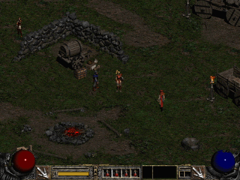
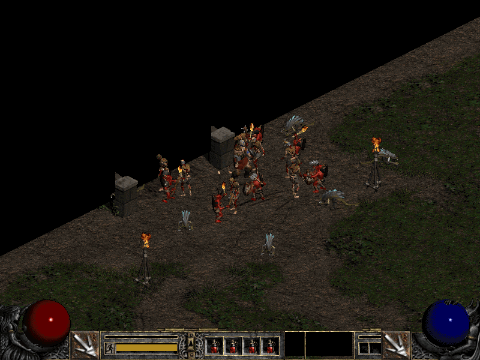
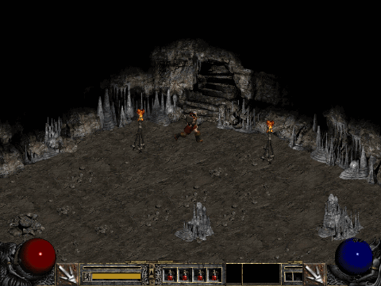
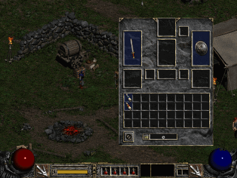

# diabloclone — Diablo II (클래식 1.14d) 웹 클론

브라우저에서 돌아가는 **Diablo II 클래식 싱글플레이** 재현 프로젝트입니다.
본인이 가진 정품 Diablo II의 MPQ 파일을 브라우저가 직접 읽어서, 원작 그래픽·사운드·수치를 그대로 씁니다.
게임 규칙은 원작 데이터 표(`*.txt`)와 D2MOO 재구성 소스를 참고해 TypeScript로 새로 구현했습니다.

> ⚠️ **이 저장소에는 원작 게임 파일이 들어 있지 않습니다.**
> 실행하려면 본인 소유의 정품 **Diablo II (클래식) 1.14d** 설치 파일이 필요합니다. 웹에서 바로 하려면 **https://gooreum.github.io/diabloclone/** 에 접속해 MPQ 파일을 고르면 됩니다. 자세한 내용은 [실행 방법](#실행-방법)을 보세요.

현재 범위는 **클래식 Act 1~4 전체와 노멀·악몽·지옥 난이도**입니다. 로그 야영지에서 시작해 디아블로를 쓰러뜨릴 때까지 할 수 있습니다.

| 로그 야영지 | 전투 (바바리안 Whirlwind) |
|---|---|
|  |  |
| **던전 (Den of Evil)** | **UI (인벤토리·스킬 트리·캐릭터·자동지도)** |
|  |  |

---

## 특징

### 원작 데이터를 그대로 사용
- **MPQ 아카이브를 브라우저에서 직접 읽습니다.**
  - HTTP Range 요청으로 필요한 부분만 가져옵니다.
  - 압축 해제기(PKWARE implode, zlib, Huffman, ADPCM)와 복호화는 직접 구현했습니다.
- **원작 파일 형식 파서:**
  - DCC: 캐릭터·몬스터 애니메이션
  - DC6: UI·아이템·글꼴
  - DT1: 타일
  - DS1: 맵 프리셋
  - COF: 레이어 합성
  - 그 밖에 팔레트·PL2 색표, `string.tbl`, 엑셀 표(`*.txt`), AnimData, WAV
- 원작 팔레트, 색 바꿈 표(유니크 RandTransforms·변종 palshift), 원작 글꼴과 글자색을 씁니다.

### 게임플레이 (Act 1~4)
- **캐릭터 5종**(아마존·소서리스·네크로맨서·팔라딘·바바리안)과 **클래스별 스킬 30개 전부**
  - 시너지, 스킬 공식, 시퀀스 애니메이션(Jab, Whirlwind 등)을 포함합니다.
- **월드 생성 (DRLG):** D2MOO 재구성 코드를 옮겨, 원작과 같은 방식으로 야외·미로 던전·프리셋 맵을 무작위로 만듭니다.
  - 로그 야영지, 루트 골레인과 사막·하수도·탈 라샤 무덤, 쿠라스트 정글·트라빈칼·증오의 억류지, 판데모니움 요새·카오스 생추어리
- **몬스터**
  - 원작 AI
  - 챔피언·유니크 무리와 접사
  - 슈퍼 유니크와 막 보스: Blood Raven, Radament, 소환사, 의회, Izual 등, Andariel·Duriel·Mephisto·Diablo
- **아이템**
  - 트레저 클래스 드롭, 접두·접미사, 매직·레어·유니크·세트
  - 내구도, 소켓
  - 감정, 수리, 상점, 도박
- **마을 NPC:** 네 마을의 대화, 상점, 막별 용병 고용, Charsi 인챈트, Cain 감정, Warriv·Meshif 막 이동
- **호라드릭 큐브:** 원작 cubemain 조합 (보석 합치기, 재료 조합 등)
- **퀘스트 21개:** Act 1 6개(Den of Evil ~ Sisters to the Slaughter), Act 2 6개(Radament's Lair ~ The Seven Tombs), Act 3 6개(The Golden Bird ~ The Guardian), Act 4 3개(The Fallen Angel ~ Terror's End)
- **난이도:** 노멀에서 디아블로를 잡으면 악몽, 악몽을 끝내면 지옥이 열립니다. 몬스터 수치, 저항 페널티, 칭호가 원작 표를 따릅니다.
- **이동:** 웨이포인트(막 I~IV 탭), 마을 포털, 자동지도(전체·미니, 시체 위치 표시)
- **원작 UI:** 조작판, 벨트, 인벤토리, 창고, 스킬 트리, 캐릭터 창, 게임 메뉴, 단축키 설정
- **사운드:** 막별 원작 음악, 효과음, NPC 인사·잡담·퀘스트 음성 (오디오 해석은 Web Worker에서)
- **저장:** 브라우저 IndexedDB에 캐릭터를 저장하고 불러옵니다. 시체와 장비 회수도 됩니다.

### 성능
- **WebGL2 팔레트 텍스처 렌더러**
  - 그림을 1바이트 팔레트 번호 텍스처 아틀라스에 올리고, 셰이더가 팔레트와 색 바꿈 표로 색을 입힙니다.
  - 그림마다 캔버스를 만들던 방식보다 그래픽 메모리가 약 1/4로 줄었습니다.
  - 색 변형용 그림을 따로 만들지 않고, 그래픽 컨텍스트를 잃었을 때도 복구합니다.
  - WebGL2를 쓸 수 없으면 2D 캔버스로 자동 대체합니다.
- **원작식 조명:** 실내 던전(levels.txt IsInside)은 빛 반경 밖이 어둡습니다.
  - 광원: 플레이어, 횃불(objects Lit), 마법(missiles Light), 빛나는 몬스터(monstats2 Light)
  - 원작 팔레트의 밝기 단계 표(Pal.PL2, 32단계)로 칠합니다. 유닛 발밑에는 그림자가 생깁니다.
- **낮·밤과 비:** 야외는 원작 규칙(D2MOO D2Environment)대로 시간이 흘러 밤에 어두워지고, 밤 배경음으로 바뀝니다. Act 1·3 야외에는 비가 옵니다.
- **Web Worker:** MPQ 압축 해제와 DCC 해석을 게임 스레드 밖에서 합니다. DCC는 **필요한 방향만** 해석합니다.
- **레벨 미리 불러오기:** 던전에 들어갈 때 로딩 화면 동안 가까운 몬스터 그림을 준비합니다.
- **측정 결과** (Apple M1, 몬스터 수십 마리 + 광역 스킬 20초, `e2e/perf.spec.ts`):

  | | 2D 캔버스 (이전) | WebGL2 (현재) |
  |---|---|---|
  | 평균 FPS | 44 | **60** |
  | 가장 긴 프레임 | 183ms | **33ms** |
  | 50ms 넘는 프레임 | 32 | **0** |
  | JS 힙 | 342MB | **212MB** |

---

## 실행 방법

### 필요한 파일 (공통)
본인 소유의 **정품 Diablo II (클래식) 1.14d** 설치 폴더에 있는 MPQ 파일 6개가 필요합니다.

| 파일 | 내용 | 필수 |
|---|---|---|
| `d2data.mpq` | 타일·몬스터·UI·데이터 표 | ✅ |
| `d2char.mpq` | 플레이어 캐릭터 그래픽 | ✅ |
| `patch_d2.mpq` | 1.14d 패치 | ✅ |
| `d2sfx.mpq` | 효과음 | 없으면 소리 없음 |
| `d2music.mpq` | 음악 | 없으면 소리 없음 |
| `d2speech.mpq` | NPC 음성 | 없으면 소리 없음 |

- Blizzard(Battle.net)에서 구매한 Diablo II를 설치하면 설치 폴더에 있습니다.
  - Windows: 보통 `C:\Program Files (x86)\Diablo II\`
  - macOS: 보통 `/Applications/Diablo II/`
- 확장팩(LoD) 파일(`d2exp.mpq` 등)은 쓰지 않습니다.

### 방법 1: 웹에서 바로 플레이 (설치 없음)
1. **https://gooreum.github.io/diabloclone/** 에 접속합니다(크롬·엣지 권장, WebGL2 필요).
2. "Diablo II 원작 파일 불러오기" 화면에서 위 MPQ 파일을 넣습니다. 방법은 셋 중 편한 것을 쓰면 됩니다.
   - **파일 선택**: MPQ 6개를 한꺼번에 고릅니다.
   - **폴더 선택**: Diablo II 설치 폴더를 통째로 고릅니다. MPQ만 골라 담습니다.
   - 파일이나 폴더를 화면에 끌어다 놓습니다.
3. 목록이 모두 ✓가 되면 **시작**을 누릅니다. 메인 메뉴가 나오면 원작처럼 Single Player로 플레이합니다.

- 파일은 서버로 전송되지 않습니다. **그 브라우저 안(IndexedDB)에만 저장**되고, 다음 접속부터는 이 화면 없이 바로 시작합니다.
- 다른 PC나 다른 브라우저에서는 처음 한 번 다시 골라야 합니다.
- 캐릭터 저장도 그 브라우저에만 남습니다. 브라우저의 사이트 데이터를 지우면 MPQ와 캐릭터가 함께 지워집니다.
- 서버(GitHub Pages)에는 게임 코드만 있고 원작 파일은 없습니다.

### 방법 2: 내 컴퓨터에서 개발 서버로 실행
- 준비물: **Node.js 20 이상** (개발 환경: Node 24)

```bash
git clone https://github.com/Gooreum/diabloclone.git
cd diabloclone
npm install

# 정품 MPQ 6개를 game-data/ 폴더에 복사 (git 에는 올라가지 않음)
mkdir game-data
cp "/설치경로/Diablo II/"{d2data,d2char,d2sfx,d2music,d2speech,patch_d2}.mpq game-data/

npm run check-data   # 파일이 모두 있고 올바른 MPQ 인지 검사
npm run dev          # http://localhost:5173
```
- 개발 서버가 `game-data/`의 파일을 `/d2/<파일명>`으로 브라우저에 제공합니다. 파일은 여러분의 컴퓨터 밖으로 나가지 않습니다.
- `http://localhost:5173/?local` 로 열면 웹 배포판과 같은 "파일 불러오기" 방식으로 실행합니다.
- 크롬 계열 브라우저를 권장합니다(WebGL2 필요).

### 배포
- `main`에 push하면 GitHub Actions(`.github/workflows/pages.yml`)가 게임 코드만 빌드해 GitHub Pages에 올립니다.
- 빌드 결과에 `.mpq`가 섞이면 배포를 멈춥니다.

---

## 조작법

| 입력 | 동작 |
|---|---|
| 마우스 왼쪽 클릭 | 이동 · 공격 · 줍기 · 대화 · 오브젝트 사용 (왼쪽 스킬) |
| 마우스 오른쪽 클릭 | 오른쪽 스킬 사용 |
| `Shift` + 클릭 | 제자리에서 공격 |
| `C` | 캐릭터 창 |
| `I` | 인벤토리 |
| `T` | 스킬 트리 |
| `Q` | 퀘스트 로그 |
| `Tab` | 자동지도 |
| `V` | 미니 자동지도 |
| `R` | 달리기/걷기 전환 |
| `S` | 스킬 선택 막대 |
| `1`~`4` | 벨트 물약 사용 |
| `` ` `` | 벨트 펼치기 |
| `Alt` | 바닥 아이템 이름 보기 |
| `N` | 메시지 지우기 |
| `Esc` | 게임 메뉴 (옵션 · 저장하고 나가기) |

단축키는 게임 메뉴 → OPTIONS → CONFIGURE CONTROLS에서 바꿀 수 있습니다(브라우저에 저장).

---

## 구조

```
src/
├── engine/     게임 규칙 (DOM 없는 순수 코드, Command 로만 입력받고 스냅샷을 내보냄)
│   ├── drlg/       월드 생성 (야외·미로·프리셋, D2MOO 이식)
│   ├── ai/         몬스터 AI
│   ├── skills/     스킬 공식·데미지·시퀀스
│   ├── quests/     퀘스트 상태 기계
│   └── game.ts     게임 루프 (25 틱/초)
├── formats/    원작 파일 파서 (MPQ, DCC, DC6, DT1, DS1, COF, WAV, 팔레트, 글꼴 …)
├── assets/     MPQ Range 로더 + 그림 해석 Web Worker
├── render/     월드 렌더링 (WebGL2 GlSink / 2D Canvas2dSink, 등각 좌표, 자동지도)
├── ui/         원작 DC6 UI (조작판·패널·메뉴·커서·글꼴)
├── audio/      사운드 (Web Audio, 해석 워커)
├── input/      마우스·키보드 → Command
└── main.ts     조립 (메뉴 → 게임 루프 → 렌더)
tests/          vitest 단위 테스트
e2e/            Playwright 브라우저 테스트
scripts/        데이터 검사·분석 도구
```

- **엔진은 렌더링과 분리돼 있습니다.** `src/engine`은 DOM·캔버스·오디오를 쓰지 않습니다(`tests/arch.test.ts`가 검사).
  - 입력은 `Command`(이동·공격·스킬 사용 등)로만 받습니다.
  - 화면은 `snapshot()` 결과만 보고 그립니다.
- **원작 동일성 원칙:** 원작에서 가져온 규칙과 수치에는 근거를 남깁니다.
  - `// 출처: …` — D2MOO 함수, 원작 데이터 표 컬럼, 포맷 문서 등 근거
  - `// 근사(원작 미확인): …` — 원작 동작을 확인하지 못해 비슷하게 만든 부분

---

## 테스트

```bash
npm test                                  # vitest 단위 테스트 (733개)
npx tsc --noEmit                          # 타입 검사
npx playwright test --workers=1           # 브라우저 e2e (59개, game-data 필요)
RECORD_GIF=1 npx playwright test e2e/record-gifs.spec.ts   # README GIF 다시 녹화
```
- 원작 파일이 필요한 테스트는 `game-data/`가 없으면 자동으로 건너뜁니다.
- e2e는 캐릭터 생성 → 마을 → 필드 → 전투 → 줍기 → 저장 → 새로고침 → 불러오기까지 실제 흐름을 검사합니다.
  - 던전 생성·렌더링, 퀘스트, 상점·용병, 웨이포인트·포털, WebGL 복구, 성능도 포함합니다.
  - `e2e/full-game.spec.ts`는 한 캐릭터로 Act 1~4 보스를 거쳐 디아블로 처치, 저장, 악몽 시작까지 한 번에 검사합니다.

---

## 로드맵
- [x] Act 1 전체 (월드·몬스터·NPC·퀘스트 6개·UI·사운드·전 스킬)
- [x] WebGL2 렌더러 + Worker 해석 + 레벨 미리 불러오기
- [x] Act 2~4 (루트 골레인 ~ 판데모니움 요새, 두리엘·메피스토·디아블로)
- [x] 악몽·지옥 난이도
- [x] 조명·그림자 (실내 어둠, 플레이어·횃불·마법·몬스터 빛 반경, 원작 PL2 밝기 단계, 유닛 그림자)
- [x] 야외 낮·밤 주기(원작 D2Environment 규칙, 밤 배경음, 오염된 태양 일식)와 비
- [ ] 확장팩(Lord of Destruction)

---

## 참고 자료·감사
- [D2MOO](https://github.com/ThePhrozenKeep/D2MOO) — Diablo II 1.10 재구성 소스 (DRLG·AI·스킬·퀘스트 규칙 참고)
- [OpenDiablo2](https://github.com/OpenDiablo2/OpenDiablo2) — DCC 디코딩, 방향 표
- [The Phrozen Keep](https://d2mods.info/) — 데이터 표·파일 형식 문서
- Paul Siramy — DCC / DT1 / DS1 파일 형식 문서
- [Zezula](http://www.zezula.net/en/mpq/mpqformat.html) — MPQ 형식 문서

## 면책
- **Diablo®와 Blizzard Entertainment®는 Blizzard Entertainment, Inc.의 상표입니다.** 이 프로젝트는 Blizzard와 관련이 없고 승인받지 않은 개인 팬 프로젝트입니다.
- 이 저장소에는 원작 게임 파일(그래픽·사운드·데이터)이 포함되어 있지 않으며, 배포하지도 않습니다. 실행하려면 본인이 소유한 정품 게임 파일이 필요합니다.
- README의 GIF는 이 프로젝트의 플레이 화면을 소개하기 위한 짧은 녹화입니다.
